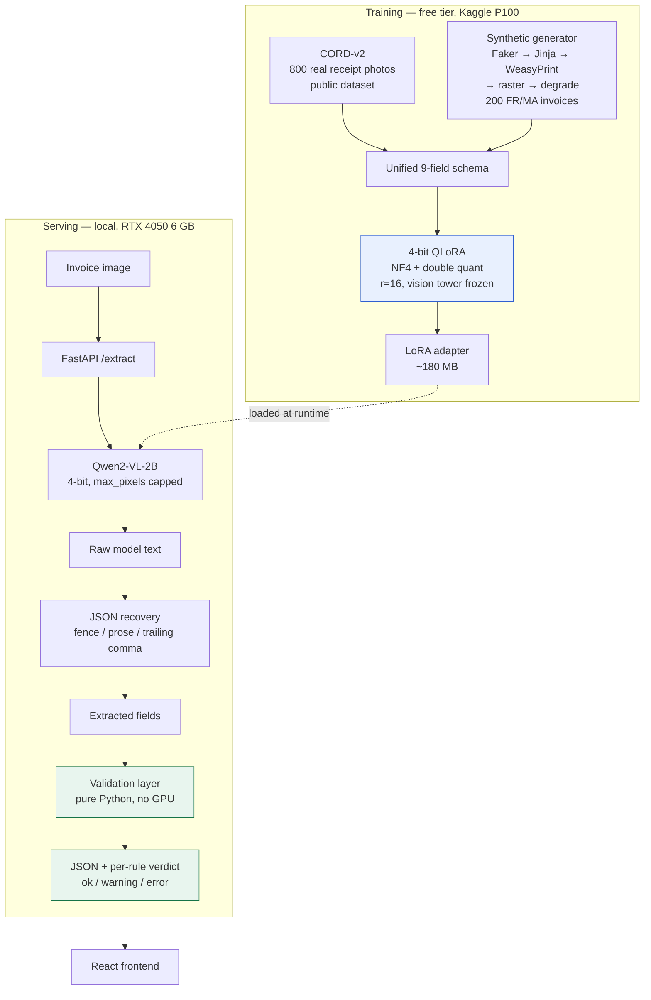
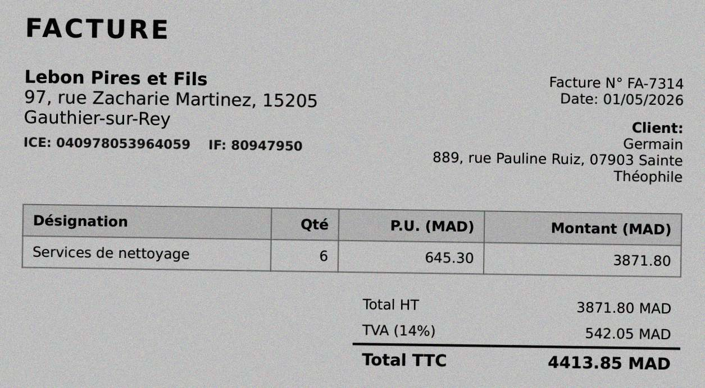

# invoice-extraction

Turn an invoice or receipt **image** into **structured JSON** an accountant can use directly,
and flag the documents that do not add up.

A small vision-language model (Qwen2-VL-2B) fine-tuned with 4-bit QLoRA on free compute,
plus a deterministic validation layer that checks the extracted numbers against accounting
rules — `Total HT + TVA = Total TTC`, line items summing to the subtotal, dates that are real.

---

## The problem

Entering supplier invoices by hand is slow, expensive and error-prone. The usual automation is
OCR plus regular expressions, which breaks on the first supplier whose layout is different —
and every supplier's layout is different.

A vision-language model reads the document the way a person does: it sees that a number sits
in the column headed *Montant*, on the row labelled *Prestation de conseil*. Layout
understanding comes for free instead of being hand-coded per supplier.

The catch is that a language model will occasionally invent a number. **That is what the
validation layer is for.** The output is not "here is a number, trust me" — it is "here is a
number, and here is whether the document's own arithmetic agrees with it".

---

## Architecture



The two halves are deliberately separable. The validation layer needs no GPU and no model —
`POST /validate` runs it standalone, so it can sit in front of an existing OCR pipeline.

---

## Results

> **Status:** the zero-shot baseline is measured on **both** test sets. The fine-tuned
> column is pending a Kaggle training run — see [Reproducing](#reproducing-the-training).
> Only measured numbers appear here; nothing is filled in by estimation.

Both test sets, `Qwen2-VL-2B-Instruct`, 4-bit, no fine-tuning, `max_pixels=401408`, 50
examples each, greedy decoding (`top_k=1`, so runs are deterministic).

### CORD-v2 test split — real receipt photographs

| Field | Precision | Recall | F1 | Support |
|---|---|---|---|---|
| subtotal | 0.650 | 0.419 | **0.510** | 31 |
| tax | 0.150 | 0.150 | **0.150** | 20 |
| total | 0.800 | 0.340 | **0.478** | 47 |
| items | 0.522 | 0.278 | **0.363** | 126 |
| ice, if_number, invoice_number, date, currency | — | — | n/a | 0 |
| **micro-average** | | | **0.346** | |

**JSON parse rate: 22/50 (44 %).**

### Synthetic held-out invoices — French/Moroccan, seeds 900000+

| Field | Precision | Recall | F1 | Support |
|---|---|---|---|---|
| subtotal | 0.688 | 0.660 | **0.673** | 50 |
| tax | 0.688 | 0.660 | **0.673** | 50 |
| total | 0.833 | 0.800 | **0.816** | 50 |
| items | 0.097 | 0.093 | **0.095** | 161 |
| ice | 0.854 | 0.820 | **0.837** | 50 |
| if_number | 1.000 | 0.960 | **0.980** | 50 |
| invoice_number | 1.000 | 0.680 | **0.809** | 50 |
| date | 1.000 | 0.680 | **0.809** | 50 |
| currency | 1.000 | 0.340 | **0.507** | 50 |
| **micro-average** | | | **0.567** | |

**JSON parse rate: 49/50 (98 %).**

### What these numbers actually say

**The parse rate gap is the story: 44 % on real photographs, 98 % on clean renders.** The
base model does not fail on receipts because reading them is hard — it fails because it stops
emitting JSON and starts writing prose. A model that is sometimes accurate and often
unparseable cannot be put in a workflow, and this is the failure fine-tuning is best at
fixing.

**The base model is already decent at isolated scalar fields on a clean document.** IF
0.980, ICE 0.837, invoice number and date 0.809. Precision is 1.000 on four fields and recall
is what drags them down — when it answers, it is right; it just often declines to answer.
Fine-tuning has less room to help here than expected, and saying so up front is more useful
than a table that implies otherwise.

**Line items collapse to 0.095, and the cause is measurable, not mysterious.** Running
[`scripts/inspect_items.py`](scripts/inspect_items.py) over the saved predictions classifies
every predicted line against what it could have come from:

| Outcome | Count |
|---|---|
| price = **unit price** (read the P.U. column) | **104** |
| price wrong for another reason | 20 |
| name did not match any gold line | 17 |
| price correct (read the Montant column) | 13 |

The unit-price distractor column is responsible for the great majority of the failure. This
is the trap the synthetic template deliberately sets, because every real invoice sets it too:

```
predicted: {"description": "Services de nettoyage", "quantity": 6, "price": "645.30"}
gold     : {"name": "Services de nettoyage", "qty": "6",          "price": "3871.80"}
```

`645.30` is the unit price; `6 × 645.30 = 3871.80` is the line total. The model also renamed
`name`→`description` and `qty`→`quantity` on some examples — schema adherence is a separate
failure from reading accuracy, and both are things fine-tuning targets directly.

`n/a` means **support 0**: CORD-v2 receipts carry no ICE, IF, invoice number, date or
currency, so those fields were never tested there rather than always wrong. Measuring them is
the entire reason the synthetic set exists.

Raw per-example outputs, including the validation verdict for each:
[`results/base_cord_predictions.json`](results/base_cord_predictions.json),
[`results/base_synthetic_predictions.json`](results/base_synthetic_predictions.json).

---

## Example

This is a **real request against the running API**, not an illustration. It is the base model
(no adapter yet), and it shows precisely why the validation layer exists.

Input — a generated Moroccan invoice (seed 900000, held-out test range), after photographic
degradation:



What the model literally returned — note the code fence and the array wrapper, both of which
the parser recovers from:

````text
```json
[ { "items": [ { "description": "Services de nettoyage", "quantity": 6,
                 "price": "645.30" } ],
    "subtotal": "645.30", "tax": "3871.80", "total": "4413.85",
    "ice": "040978053964059", "if_number": "80947950" } ]
```
````

Parsed, against the gold answer:

| Field | Model | Gold | |
|---|---|---|---|
| line item price | `645.30` | `3871.80` | ✗ read the P.U. column |
| subtotal | `645.30` | `3871.80` | ✗ same mistake |
| tax | `3871.80` | `542.05` | ✗ shifted one row up |
| total | `4413.85` | `4413.85` | ✓ |
| ice | `040978053964059` | `040978053964059` | ✓ |
| if_number | `80947950` | `80947950` | ✓ |
| invoice_number, date, currency | missing | `FA-7314`, `2026-05-11`, `MAD` | ✗ not emitted |

Every number the model produced is a number that genuinely appears on the document. Nothing
looks obviously wrong. **This is the dangerous failure mode** — and the validation layer
catches it with no reference answer, using only the document's own arithmetic:

```json
{
  "valid": false,
  "severity": "error",
  "needs_review": true,
  "unverified": ["date_valid", "currency_known"],
  "checks": [
    { "check": "tax_arithmetic", "status": "fail",
      "detail": "subtotal 645.30 + tax 3871.80 = 4517.10, stated total 4413.85 (difference 103.25)" },
    { "check": "tax_rate_plausible", "status": "fail",
      "detail": "implied VAT rate 600.00%, nearest standard Moroccan rate 20%" },
    { "check": "ice_format",  "status": "pass",    "detail": "15 digits (expected 15)" },
    { "check": "if_format",   "status": "pass",    "detail": "8 digits (expected 7-9)" },
    { "check": "items_sum",   "status": "pass",    "detail": "1 line item(s) sum to 645.30, subtotal 645.30" },
    { "check": "date_valid",  "status": "skipped", "detail": "not checkable: no date extracted" }
  ]
}
```

`severity: "error"` — do not post this automatically. A 600 % VAT rate is not a subtle hint.

Two details worth noticing. `items_sum` **passes**, because the model was self-consistently
wrong: it put the unit price in both the line and the subtotal. One rule alone would have
missed this; the rules catch it as a set. And `date_valid` is **skipped**, not failed — the
model emitted no date, so the rule could not run, and reporting that as a violation would be
a lie about what was checked.

Full response: [`docs/assets/example_api_response.json`](docs/assets/example_api_response.json).
Response time 22 s on the 6 GB laptop GPU.

---

## The validation layer

Business rules run on the model's output, with no reference answer — which is the point,
because in production there is no gold label. The only automatic signal that an extraction is
wrong is that it contradicts itself.

| Rule | Check | On failure |
|---|---|---|
| `required_fields` | a total is present at all | error |
| `tax_arithmetic` | Total HT + TVA = Total TTC | error |
| `items_sum` | line items sum to Total HT | error |
| `tax_rate_plausible` | implied VAT rate is 20 / 14 / 10 / 7 % | warning |
| `date_valid` | parses, not in the future, not >10 years old | warning |
| `ice_format` | exactly 15 digits | warning |
| `if_format` | 7–9 digits | warning |
| `currency_known` | a recognised currency code | warning |

Each rule returns **pass**, **fail** or **skipped** — not just pass/fail. A rule that cannot
run because the document does not carry the fields it needs is *unverified*, not *violated*.
Without that distinction every CORD receipt got reported as an arithmetic error purely for
having no Moroccan ICE number, and a report full of meaningless red flags is worse than no
report. See [DECISIONS §9](docs/DECISIONS.md#9-why-the-validation-layer-has-three-outcomes-not-two).

---

## Setup

Requires Linux or WSL2, and an NVIDIA GPU for the model (the validation layer and tests run
anywhere).

```bash
git clone https://github.com/Israe236/invoice-extraction.git
cd invoice-extraction

# Python environment (uv resolves the CUDA-matched torch build from pyproject.toml)
uv venv --python 3.11
uv pip install -e ".[dev,api]"

# Tests need no GPU and no downloads
pytest
```

### Run the demo

```bash
# Terminal 1 — API (add INVOICE_ADAPTER=checkpoints/... to serve the fine-tuned model)
uvicorn invoice_extraction.api:app --port 8000

# Terminal 2 — frontend
cd frontend && npm install && npm run dev
# open http://localhost:5173
```

The first `/extract` request loads the model onto the GPU and takes about a minute; after that
it is roughly 50 s per document on a 6 GB laptop card.

### Evaluate

```bash
python -m invoice_extraction.baseline --dataset cord      --out results/base_cord.json
python -m invoice_extraction.baseline --dataset synthetic --out results/base_synthetic.json

# with a trained adapter
python -m invoice_extraction.baseline --dataset cord --adapter checkpoints/qwen2vl-2b-lora-v2 \
    --out results/finetuned_cord.json
```

---

## Reproducing the training

Training does not fit in 6 GB, so it runs on Kaggle's free tier.

1. Upload [`notebooks/train_kaggle.ipynb`](notebooks/train_kaggle.ipynb) to Kaggle.
2. Set **Accelerator → GPU P100** and **Internet → On**.
3. Run the smoke-test cell first (3 steps, ~5 minutes). It catches the failures that would
   otherwise waste a two-hour session.
4. Run the full cell (~2.5 h for one epoch over 1000 examples).
5. Download `qwen2vl-2b-lora-v2.zip` from the Output panel and unzip it into `checkpoints/`.

The notebook clones this repository rather than carrying its own copy of the training code, so
what runs on Kaggle is exactly what is in version control.

---

## Data

| Source | What | Licence |
|---|---|---|
| [CORD-v2](https://huggingface.co/datasets/naver-clova-ix/cord-v2) | 1000 real receipt photographs (800 train / 100 val / 100 test) | public research dataset |
| Synthetic FR/MA invoices | generated in-repo: Faker → Jinja → WeasyPrint → PyMuPDF → Albumentations degradation | generated, no licence issue |

**No real client data is used anywhere in this project.** Every company name, address, ICE and
IF number in the synthetic set is generated. CORD-v2 receipts have no ICE, IF, invoice number,
date or currency, which is precisely why the synthetic invoices exist — without them the model
cannot learn the fields the project is actually about.

Train and test synthetic invoices are drawn from **disjoint seed ranges** (42+ vs 900 000+).
Faker is deterministic, so a shared seed would put a byte-identical document in both sets;
there is a test asserting the ranges cannot collide.

---

## Project layout

```
src/invoice_extraction/
  data.py            CORD-v2 → the unified 9-field schema, chat formatting
  synthetic.py       generated French/Moroccan invoice data
  render.py          HTML → PDF → raster → photographic degradation, content cropping
  normalize.py       money / date / text normalisation, shared by metric and rules
  evaluate.py        JSON recovery, per-field P/R/F1, parse rate, support
  validate.py        the business rules
  model.py           4-bit loading, VRAM-safe defaults
  train.py           QLoRA fine-tuning
  baseline.py        evaluation entry point (base and fine-tuned, same code path)
  api.py             FastAPI service
frontend/            React + Vite demo
tests/               238 tests, no GPU required
configs/             all hyperparameters
docs/DECISIONS.md    why every choice was made
notebooks/           Kaggle training notebook
results/             measured evaluation output (committed — it is the evidence)
```

---

## Limitations

Stated plainly, because a portfolio project claiming no weaknesses is not credible.

- **Small test sets.** 50 CORD receipts, 50 synthetic invoices. Enough to see a large effect,
  not enough for tight confidence intervals per field.
- **One synthetic template.** Degradation varies the pixels; the layout does not vary. The
  model has seen one way of arranging a Moroccan invoice. This is the biggest gap.
- **No real Moroccan invoices tested.** By design (no real client data), but it means the
  ICE/IF/date numbers are measured against the same generator that produced the training data
  and should be read as an upper bound.
- **One epoch, one seed.** No learning-rate sweep, no early stopping, no variance estimate.
- **~50 s per document** on a 6 GB laptop GPU in 4-bit. Fine for a demo, too slow for bulk
  processing.
- **CORD's `service_price` is excluded** from the schema, so some real receipts legitimately
  fail `items_sum`. Documented rather than quietly tolerated.

## Next steps

1. **More synthetic layouts** — three or four distinct templates. Attacks the biggest
   limitation and costs no GPU time.
2. **More epochs with a validation loss** and early stopping.
3. **Qwen3-VL-2B-Instruct** — it did not exist when this project started (Qwen3-VL began at
   4B) and has since been released. Re-running the same pipeline needs only a config change.
4. **Constrained decoding** — a JSON grammar would take the parse rate to 100 % by
   construction rather than by training.
5. **Per-field confidence**, so the validation layer can say *which* number it doubts.

---

## Licence

MIT. CORD-v2 is subject to its own licence.
