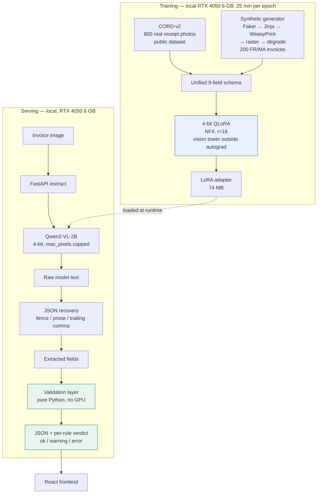
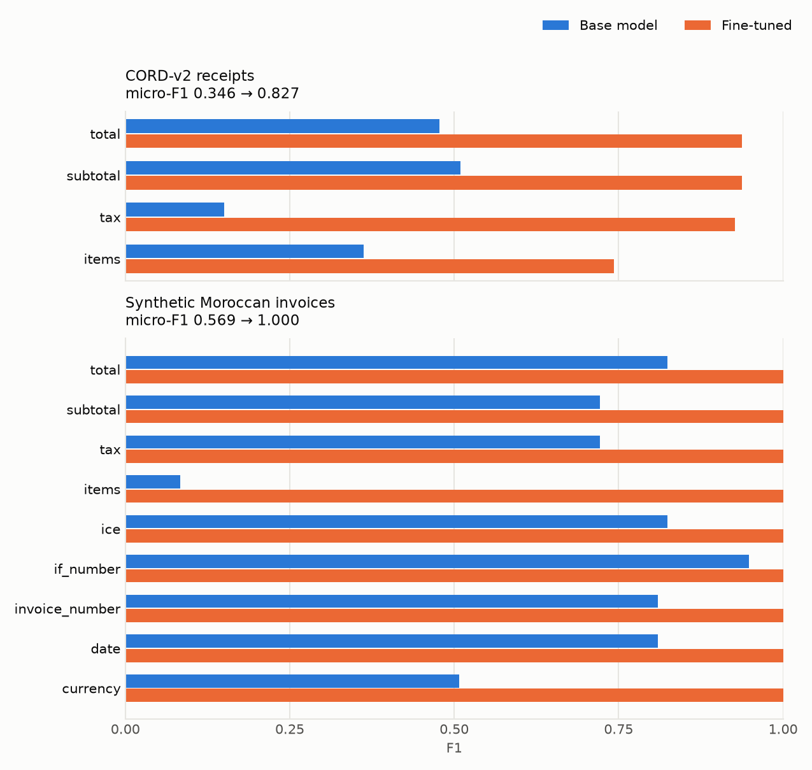
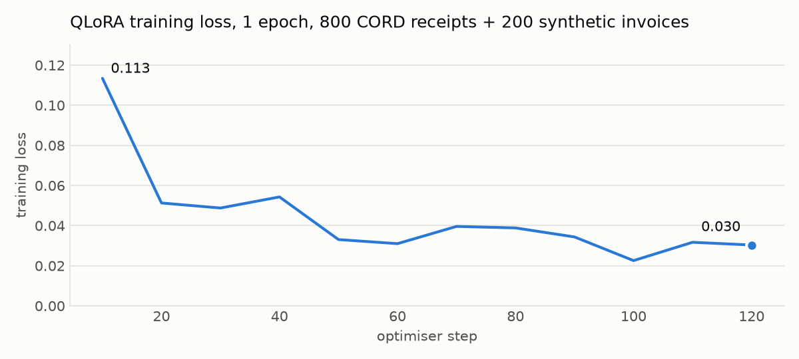

# invoice-extraction

Turn an invoice or receipt **image** into **structured JSON** an accountant can use directly,
and flag the documents that do not add up.

A small vision-language model (Qwen2-VL-2B) fine-tuned with 4-bit QLoRA, plus a deterministic
validation layer that checks the extracted numbers against accounting rules —
`Total HT + TVA = Total TTC`, line items summing to the subtotal, dates that are real.
Everything, including training, runs on a 6 GB laptop GPU.

| Held-out test set (50 documents each) | Base model | Fine-tuned |
|---|---|---|
| CORD-v2 real receipt photos — micro-F1 | 0.346 | **0.827** |
| CORD-v2 — valid JSON returned | 22/50 | **50/50** |
| Synthetic Moroccan invoices — micro-F1 | 0.569 | **1.000** ¹ |
| Wrong totals that passed validation unflagged, all four runs | 0 of 23 | 0 of 23 |

¹ An upper bound, not a production estimate. The test invoices come from the same single
template the model was trained on. See [Limitations](#limitations).

---

## The problem

Entering supplier invoices by hand is slow, expensive and error-prone. The usual automation is
OCR plus regular expressions, which breaks on the first supplier whose layout is different —
and every supplier's layout is different.

A vision-language model reads the document the way a person does: it sees that a number sits
in the column headed *Montant*, on the row labelled *Prestation de conseil*. Layout
understanding comes for free instead of being hand-coded per supplier.

The catch is that a language model will occasionally produce a wrong number that looks
perfectly plausible. **That is what the validation layer is for.** The output is not "here is a
number, trust me" — it is "here is a number, and here is whether the document's own arithmetic
agrees with it".

---

## Architecture



The two halves are deliberately separable. The validation layer needs no GPU and no model —
`POST /validate` runs it standalone, so it can sit in front of an existing OCR pipeline.

---

## Results

`Qwen2-VL-2B-Instruct`, 4-bit, `max_pixels=401408`, 50 documents per test set, greedy decoding
(`top_k=1`, so a run is deterministic). The base and fine-tuned models go through **the same
prompt, the same preprocessing and the same scoring code** — `baseline.run_evaluation`, with
or without `--adapter`. Every number below was written to [`results/`](results/) by a run; the
tables are printed from those files by `python scripts/results_table.py`, not typed by hand.

<picture>
  <source media="(prefers-color-scheme: dark)" srcset="docs/assets/f1_comparison_dark.png">
  
</picture>

### CORD-v2 test split — real receipt photographs

| Field | Base F1 | Fine-tuned F1 | Change | Support |
|---|---|---|---|---|
| subtotal | 0.510 | **0.938** | +0.428 | 31 |
| tax | 0.150 | **0.927** | +0.777 | 20 |
| total | 0.478 | **0.938** | +0.460 | 47 |
| items | 0.363 | **0.743** | +0.381 | 126 |
| ice, if_number, invoice_number, date, currency | n/a | n/a | | 0 |
| **micro-average** | 0.346 | **0.827** | +0.480 | |
| **valid JSON returned** | 22/50 (44%) | **50/50 (100%)** | | |

### Synthetic held-out invoices — French/Moroccan, seeds 900000+

| Field | Base F1 | Fine-tuned F1 | Change | Support |
|---|---|---|---|---|
| subtotal | 0.722 | **1.000** | +0.278 | 50 |
| tax | 0.722 | **1.000** | +0.278 | 50 |
| total | 0.825 | **1.000** | +0.175 | 50 |
| items | 0.083 | **1.000** | +0.917 | 161 |
| ice | 0.825 | **1.000** | +0.175 | 50 |
| if_number | 0.949 | **1.000** | +0.051 | 50 |
| invoice_number | 0.809 | **1.000** | +0.191 | 50 |
| date | 0.809 | **1.000** | +0.191 | 50 |
| currency | 0.507 | **1.000** | +0.493 | 50 |
| **micro-average** | 0.569 | **1.000** | +0.431 | |
| **valid JSON returned** | 48/50 (96%) | **50/50 (100%)** | | |

`n/a` means **support 0**: CORD-v2 receipts carry no ICE, IF, invoice number, date or currency,
so those fields were never tested there — which is different from scoring zero. Measuring them
is the entire reason the synthetic set exists.

### What these numbers actually say

**On real photographs, the base model's main failure was not reading — it was format.** It
returned valid JSON for only 22 of 50 receipts, and wrote prose for the rest. Fine-tuning took
that to 50 of 50, and every field CORD contains roughly doubled. Tax went from 0.150 to 0.927.

**CORD line items (0.743) are the weakest real-world number.** Receipts list items in
inconsistent formats, and this is where more data would help most.

**The synthetic 1.000 is real but narrow.** The fine-tuned model got every field of all 50
held-out invoices exactly right. Those invoices share the single template the model trained on,
with only the pixels degraded differently, so this measures "learned this layout", not "reads
any Moroccan invoice". Read it as an upper bound.

**Fine-tuning fixed one specific, measurable mistake.** Every synthetic invoice prints a unit
price (*P.U.*) next to the line total (*Montant*), because every real invoice does.
[`scripts/inspect_items.py`](scripts/inspect_items.py) pairs each predicted line with a gold
line and checks where its price came from:

| Line-item price | Base model | Fine-tuned |
|---|---|---|
| correct (read the Montant column) | 13 | **161** |
| wrong: read the **unit price** column | **124** | 0 |
| predicted line with no matching gold line | 15 | 0 |

Of the 137 lines the base model matched by name, 124 took the unit price. After fine-tuning,
161 of 161 were correct.

**Single-run numbers are noisier than three decimals suggest.** The synthetic test set was
re-scored after a bug fix that changed only the date printed on each invoice
([DECISIONS §10](docs/DECISIONS.md#10-things-that-broke-and-the-fixes)). The base model's
per-field F1 moved by as much as 0.049 from that alone, while its micro-F1 moved by 0.002. The
fine-tuned model stayed at 1.000. Treat small differences between runs accordingly.

Raw per-document outputs, each with its validation verdict:
[`base_cord`](results/base_cord_predictions.json) ·
[`finetuned_cord`](results/finetuned_cord_predictions.json) ·
[`base_synthetic`](results/base_synthetic_predictions.json) ·
[`finetuned_synthetic`](results/finetuned_synthetic_predictions.json).

---

## Example

The same held-out invoice (seed 900000), read by both models. The outputs are copied verbatim
from the saved evaluation predictions, and the fine-tuned result was also reproduced through a
live `POST /extract` request against the running API.


**Base model** — what it literally returned:

````text
```json
{
  "items": [ { "description": "Services de nettoyage", "quantity": 6, "price": "645.30" } ],
  "subtotal": "3871.80", "tax": "542.05", "total": "4413.85",
  "ice": "040978053964059", "if_number": "80947950",
  "invoice_number": "FA-7314", "date": "01/05/2026"
}
```
````

**Fine-tuned model:**

```json
{"items": [{"name": "Services de nettoyage", "qty": "6", "price": "3871.80"}],
 "subtotal": "3871.80", "tax": "542.05", "total": "4413.85",
 "ice": "040978053964059", "if_number": "80947950",
 "invoice_number": "FA-7314", "date": "2026-05-01", "currency": "MAD"}
```

| Field | Base model | Fine-tuned | Gold |
|---|---|---|---|
| line price | `645.30` ✗ unit price | `3871.80` ✓ | `3871.80` |
| line keys | `description`, `quantity` ✗ | `name`, `qty` ✓ | `name`, `qty` |
| subtotal, tax, total | ✓ | ✓ | `3871.80`, `542.05`, `4413.85` |
| ice, if_number, invoice_number | ✓ | ✓ | |
| date | `01/05/2026` ✓ ² | `2026-05-01` ✓ | `2026-05-01` |
| currency | missing ✗ | `MAD` ✓ | `MAD` |

² The prompt asks for `YYYY-MM-DD`, but the metric parses dates day-first, so the printed
format still scores as correct. An accountant would not call that a mistake.

**The validation layer caught the base model's error without seeing the gold answer.** The
totals were right, so `Total HT + TVA = Total TTC` passed. That is exactly the case where a
totals-only check would wave the document through. The line-item rule did not:

```json
{
  "severity": "error",
  "unverified": ["currency_known"],
  "checks": [
    { "check": "tax_arithmetic", "status": "pass",
      "detail": "subtotal 3871.80 + tax 542.05 = 4413.85, stated total 4413.85 (difference 0.00)" },
    { "check": "items_sum", "status": "fail",
      "detail": "1 line item(s) sum to 645.30, subtotal 3871.80 (difference 3226.50)" },
    { "check": "tax_rate_plausible", "status": "pass", "detail": "implied VAT rate 14.00%" },
    { "check": "date_valid", "status": "pass", "detail": "2026-05-01" },
    { "check": "currency_known", "status": "skipped", "detail": "not checkable: no currency extracted" }
  ]
}
```

`currency_known` is **skipped**, not failed. The base model emitted no currency, so the rule
could not run, and reporting that as a violation would misstate what was checked. The
fine-tuned output passes all eight rules with `severity: "ok"`.

Live API response for the fine-tuned model:
[`docs/assets/example_api_response.json`](docs/assets/example_api_response.json).

---

## The validation layer

Business rules run on the model's output, with no reference answer — which is the point,
because in production there is no gold label. The only automatic signal that an extraction is
wrong is that it contradicts itself.

| Rule | Check | On failure |
|---|---|---|
| `required_fields` | a total is present at all | error |
| `tax_arithmetic` | Total HT + TVA = Total TTC | error |
| `items_sum` | line items sum to Total HT | error |
| `tax_rate_plausible` | implied VAT rate is 20 / 14 / 10 / 7 % | warning |
| `date_valid` | parses, not in the future, not >10 years old | warning |
| `ice_format` | exactly 15 digits | warning |
| `if_format` | 7–9 digits | warning |
| `currency_known` | a recognised currency code | warning |

Each rule returns **pass**, **fail** or **skipped**. A rule that cannot run because the document
does not carry the fields it needs is *unverified*, not *violated*. Without that distinction,
every CORD receipt got reported as an arithmetic error purely for having no Moroccan ICE
number, and a report full of meaningless red flags is worse than no report.

### Does the flag actually work?

On the test sets the gold answers are known, so the claim can be checked
([`scripts/validation_value.py`](scripts/validation_value.py)). A document counts when its gold
has a subtotal, tax and total. "Totals correct" means all three match gold within a cent.

| Run | Documents with wrong totals | …of which flagged | Unflagged documents | …of which totals correct |
|---|---|---|---|---|
| Base, CORD | 5 | **5** | 2 | **2** |
| Fine-tuned, CORD | 1 | **1** | 10 | **10** |
| Base, synthetic | 17 | **17** | 0 | — |
| Fine-tuned, synthetic | 0 | — | 50 | **50** |

**All 23 documents with wrong totals were flagged. No unflagged document carried a wrong
total** in any run.

The flag is conservative on real receipts. On fine-tuned CORD it raised an error on 10
receipts, and 9 of those had correct totals. Those are not model mistakes: running the same
rules over the **gold answers** shows 15 of the 50 CORD receipts fail on their own, because the
printed total already includes tax or includes a charge this schema does not capture. For
accounting, sending some correct documents to a human is the right way round. The fix belongs
in the schema, not in looser rules.
[DECISIONS §9](docs/DECISIONS.md#9-why-the-validation-layer-has-three-outcomes-not-two) has
the full reasoning.

---

## Setup

Requires Linux or WSL2, and an NVIDIA GPU for the model. The validation layer and the tests run
anywhere.

```bash
git clone https://github.com/Israe236/invoice-extraction.git
cd invoice-extraction

# Python environment (uv resolves the CUDA-matched torch build from pyproject.toml)
uv venv --python 3.11
uv pip install -e ".[dev,api]"

# 259 tests, no GPU and no downloads needed
pytest
```

### Run the demo

```bash
# Terminal 1 — API, serving the fine-tuned adapter
INVOICE_ADAPTER=checkpoints/qwen2vl-2b-lora-v2 uvicorn invoice_extraction.api:app --port 8000

# Terminal 2 — frontend
cd frontend && npm install && npm run dev
# open http://localhost:5173
```

The first `/extract` request loads the model onto the GPU, which takes about a minute. On the
6 GB laptop GPU, the live request in the example above then spent 39.5 s generating. Inside the
evaluation loop, the fine-tuned model averaged about 12 s per CORD receipt. For synthetic
invoices, which need all nine fields, the loop averaged 26 s per document including rendering
and model loading.

### Evaluate

```bash
python -m invoice_extraction.baseline --dataset cord      --out results/base_cord.json
python -m invoice_extraction.baseline --dataset synthetic --out results/base_synthetic.json

# with the trained adapter
python -m invoice_extraction.baseline --dataset cord --adapter checkpoints/qwen2vl-2b-lora-v2 \
    --out results/finetuned_cord.json --predictions results/finetuned_cord_predictions.json

python scripts/results_table.py      # README tables, from results/
python scripts/plot_results.py       # README figures, from results/
python scripts/validation_value.py   # does the flag predict wrong totals?
```

---

## Reproducing the training

### On a 6 GB local GPU (how the reported adapter was trained)

```bash
python -m invoice_extraction.train configs/train_local_smoke.yaml   # 3 steps, ~1 min
python -m invoice_extraction.train configs/train_local.yaml         # 1 epoch, ~25 min
```

Measured on an RTX 4050 laptop GPU: peak 4.16 GB VRAM, and 25 minutes for one epoch over 1000
examples. It did not fit at first; the run died with `CUDA driver error: device not ready`.
Four fixes made it fit:
- capping PyTorch below the VRAM Windows actually leaves free,
- running the frozen vision tower outside autograd,
- casting a frozen 0.87 GB fp32 embedding back to bf16,
- making sure gradient checkpointing was really on.

The whole debugging story is in
[DECISIONS §10a](docs/DECISIONS.md#10a-how-training-was-made-to-fit-on-the-local-gpu). Under
WSL2, raise the VM's memory first — see [`docs/wslconfig.example`](docs/wslconfig.example).

<picture>
  <source media="(prefers-color-scheme: dark)" srcset="docs/assets/loss_curve_dark.png">
  
</picture>

Training loss, logged every 10 optimiser steps. Raw values are in
[`results/train_v2_log_history.json`](results/train_v2_log_history.json).

### On Kaggle's free tier (no local GPU)

1. Upload [`notebooks/train_kaggle.ipynb`](notebooks/train_kaggle.ipynb) to Kaggle.
2. Set **Accelerator → GPU P100** and **Internet → On**.
3. Run the smoke-test cell first (3 steps). It catches the failures that would otherwise waste a
   long session.
4. Run the full cell, then download the adapter zip from the Output panel into `checkpoints/`.

The notebook clones this repository rather than carrying its own copy of the training code, so
what runs on Kaggle is exactly what is in version control.

---

## Data

| Source | What | Licence |
|---|---|---|
| [CORD-v2](https://huggingface.co/datasets/naver-clova-ix/cord-v2) | 1000 real receipt photographs (800 train / 100 val / 100 test) | public research dataset |
| Synthetic FR/MA invoices | generated in-repo: Faker → Jinja → WeasyPrint → PyMuPDF → Albumentations degradation | generated, no licence issue |

**No real client data is used anywhere in this project.** Every company name, address, ICE and
IF number in the synthetic set is generated. CORD-v2 receipts have no ICE, IF, invoice number,
date or currency, which is precisely why the synthetic invoices exist.

Train and test synthetic invoices come from **disjoint seed ranges** (42+ vs 900 000+). Dates
come from a fixed window, so a seed produces the same document on any day. Tests pin both.

---

## Project layout

```
src/invoice_extraction/
  data.py            CORD-v2 → the unified 9-field schema, chat formatting
  synthetic.py       generated French/Moroccan invoice data
  render.py          HTML → PDF → raster → photographic degradation, content cropping
  normalize.py       money / date / text normalisation, shared by metric and rules
  evaluate.py        JSON recovery, per-field P/R/F1, parse rate, support
  validate.py        the business rules
  model.py           4-bit loading, VRAM-safe defaults
  train.py           QLoRA fine-tuning, including the 6 GB memory fixes
  baseline.py        evaluation entry point (base and fine-tuned, same code path)
  api.py             FastAPI service
scripts/             tables, figures and diagnostics, computed only from results/
frontend/            React + Vite demo
tests/               259 tests, no GPU required
configs/             all hyperparameters (train.yaml, train_local.yaml, baseline.yaml)
docs/DECISIONS.md    why every choice was made, including what went wrong
notebooks/           Kaggle training notebook
results/             measured evaluation output (committed — it is the evidence)
```

---

## Limitations

Stated plainly, because a portfolio project claiming no weaknesses is not credible.

- **One synthetic template.** Degradation varies the pixels, not the layout, so the synthetic
  1.000 measures "learned this layout". This is the biggest gap.
- **No real Moroccan invoices tested.** This is by design, since no real client data is used.
  It means the ICE, IF, date and currency numbers come from the same generator as the training
  data.
- **Small test sets, one run.** 50 documents per set, one epoch, one seed. A date-only change to
  the images moved base-model fields by up to 0.049, which gives a sense of the noise.
- **The validation flag is conservative on real receipts.** 15 of 50 CORD gold answers fail the
  rules on their own, because of tax-inclusive totals and charges the schema does not capture.
  9 of the 10 receipts flagged for the fine-tuned model had correct totals.
- **CORD line items reach 0.743**, the weakest real-world field.
- **Latency is demo-grade.** About 12–40 s per document on a 6 GB laptop GPU in 4-bit.

## Next steps

1. **More synthetic layouts.** Three or four distinct templates attack the biggest limitation
   and cost no GPU time.
2. **A richer schema:** a tax-inclusive flag and an "other charges" field, to remove most of the
   validation false alarms on real receipts.
3. **Several seeds and a validation loss**, to put error bars on the numbers and pick the epoch
   count by evidence.
4. **Qwen3-VL-2B-Instruct.** It did not exist when this project started and has since been
   released. Re-running the pipeline needs only a config change.
5. **Faster inference.** Merge the adapter and batch requests.
6. **Per-field confidence**, so the validation layer can say *which* number it doubts.

---

## Licence

MIT. CORD-v2 is subject to its own licence.
